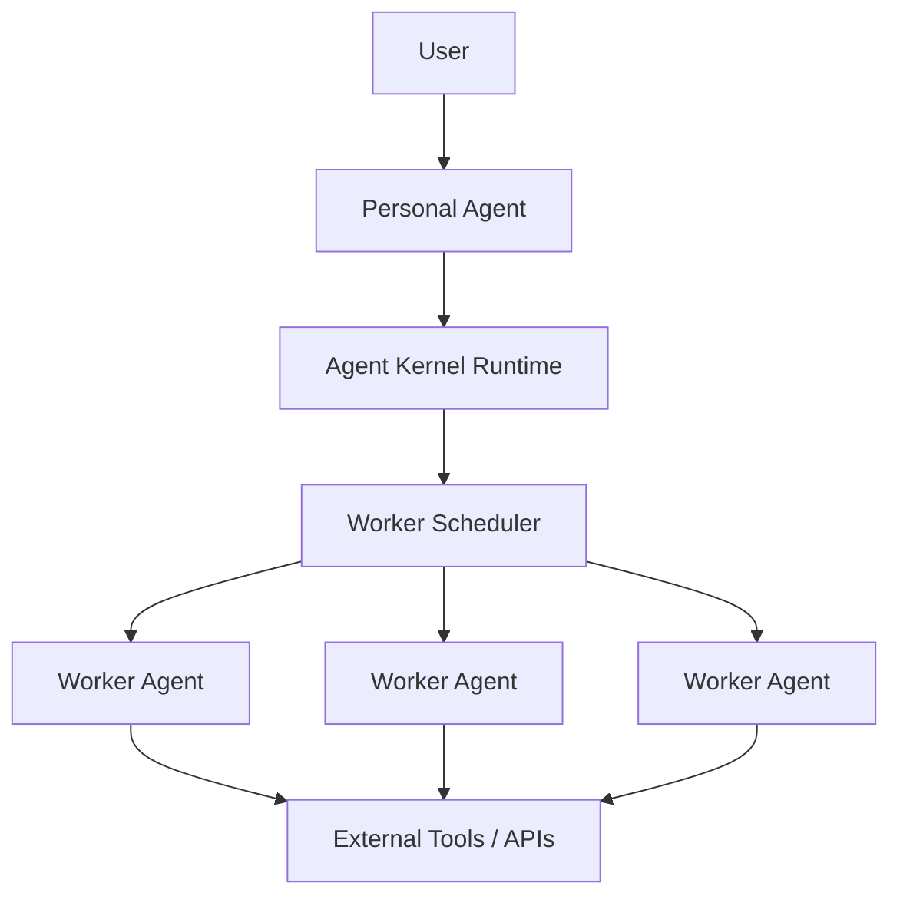
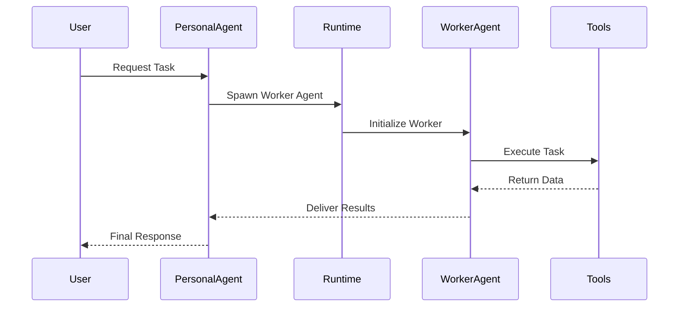
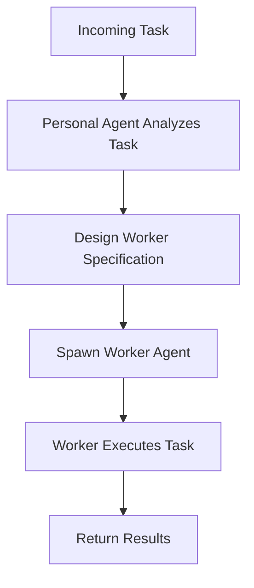
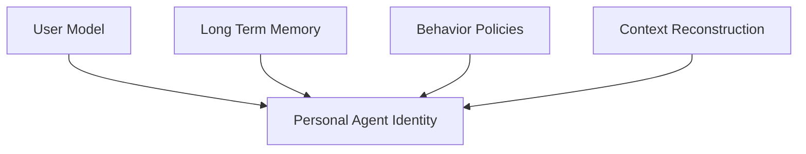
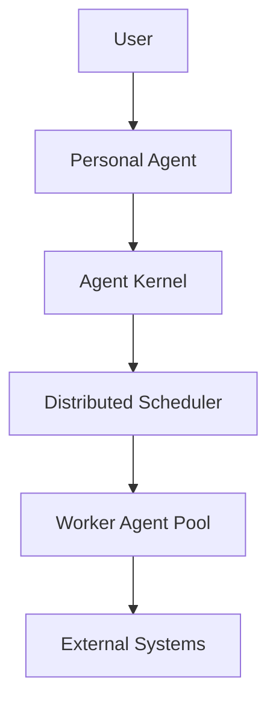

# Architecture Diagrams

This document contains visual diagrams describing the architecture of the Agent Operating System.

GitHub automatically renders Mermaid diagrams inside Markdown.

---

# High-Level System Architecture

This diagram shows the core layers of the system:

User → Personal Agent → Runtime → Worker Agents → External Systems

---

# Task Delegation Flow

This diagram describes how the personal agent delegates tasks to workers.

---

# Worker Creation Process

This diagram describes how workers are dynamically created for tasks.

---

# Identity Continuity Model

This diagram illustrates how persistent identity is maintained.

---

# Future Distributed Architecture

This diagram shows how the architecture scales to large distributed systems.
